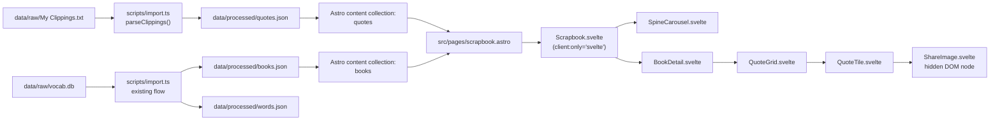
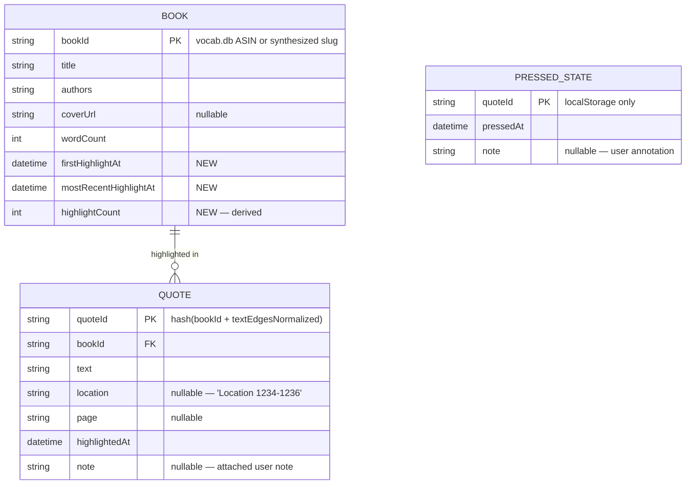

# ✨ Quotes Tab — The Scrapbook Bed

A second bed for the Literary Garden, built around browsing Kindle highlights via a horizontal spine-carousel inspired by adammaj.com, tethered to the existing garden aesthetic.

## Enhancement Summary

**Deepened on:** 2026-04-22
**Sections enhanced:** all 6 phases + Risk Analysis + new Research Insights appendix
**Research agents used:** kieran-typescript, julik-frontend-races, architecture-strategist, code-simplicity, pattern-recognition, performance-oracle, data-integrity-guardian, security-sentinel, best-practices-researcher, framework-docs-researcher, git-history-analyzer, agent-native-reviewer

### Key improvements carried into the plan

1. **Baseline warning (critical):** `Nav.astro`, `leather/gold/wax/wisteria/teal` palette tokens, and `.watercolor-paper` utility are **uncommitted in the working tree**. Commit baseline before implementation.
2. **Quote ID hash rewritten.** Edge-window hashing doesn't actually survive Kindle re-highlight boundary shifts. Replaced with full-normalized-text hash + soft-match orphan reattachment.
3. **Mount-time prune-writeback removed.** Replaced with read-time filtering to avoid cross-tab destructive race.
4. **Svelte 5 event syntax corrected**: `on:storage` → `onstorage={handler}`.
5. **IntersectionObserver axis bug fixed**: horizontal rootMargin needed (`'0px -40% 0px -40%'`), not vertical.
6. **`html-to-image` flow hardened**: `toBlob` + `URL.createObjectURL` (iOS >2MB data-URL fail), double rAF, explicit `document.fonts.load(textContent)` for unicode-range subsets, inline watercolor texture as data-URL.
7. **Shared types + branded IDs.** `src/lib/types.ts` (z.infer) and `src/lib/ids.ts` (`BookId`, `QuoteId`) land in Phase 1.
8. **`ShareImage` is a singleton**, not per-tile — hoisted to `Scrapbook.svelte`.
9. **Kindle format robustness**: regex splitter `/\r?\n=+\r?\n/`, BOM strip, NFC normalize (drop `toLowerCase` for Turkish-I safety), locale-aware metadata detection, naive-local timestamp parsing.
10. **Atomic JSON writes** via temp+rename in the importer.
11. **Naming parity**: `savePress/removePress/loadAllPresses` to mirror `progress.ts` shape.
12. **iOS mobile carousel fix**: `scroll-snap-stop: always` per spine; prefer `scrollend` over IO for focus commit.

### New considerations discovered

- Nav label casing inconsistency (`"the papers"` vs `"garden"`); pick all-articled or none.
- "Press" verb overload (words-bed mastery state vs scrapbook curation action) — document in CLAUDE.md.
- `aria-controls` drops from tablist (chatty under auto-activation); keep `aria-live` only.
- Schema migration ladder (not archive-and-reset) required for both `progress.ts` and `scrapbook.ts`.
- Anthology false-positive: don't strip numeric/roman parens in `cleanTitle`.
- Cross-tab storage handler must revalidate schema before applying sibling writes.

## Overview

Add a new `/scrapbook` tab to the Literary Garden site. The shelf is a horizontal carousel of book spines with the focused book rendered face-forward (real Kindle cover JPG). Beneath the carousel, an always-visible detail pane shows the focused book's title, metadata, and a mixed-rhythm quote grid (one hero pull-quote + smaller masonry tiles). Users can "press" quotes to favorite them; a shelf toggle filters the carousel to books with ≥1 pressed quote. Every quote can be exported as a share image (client-side PNG). Quotes are imported at build time from Kindle `My Clippings.txt` via an extension to the existing `scripts/import.ts` pipeline.

This plan carries forward every decision from the brainstorm and resolves its nine open questions. Key decisions carried: spine-carousel pattern, tether to garden palette via deeper tokens, hybrid curation with filter mode, share image per quote, client-side render. (See brainstorm: `docs/brainstorms/2026-04-22-quotes-tab-scrapbook-brainstorm.md`.)

## Problem Statement

The Literary Garden v1 (`docs/plans/2026-04-21-feat-literary-garden-v1-words-bed-plan.md`) shipped the words bed — a vocabulary-practice surface using Kindle Vocabulary Builder data. The original brainstorm (`docs/brainstorms/2026-04-21-literary-garden-brainstorm.md`) scoped a companion "quotes bed" as outward, browsing-oriented, for quotes the user has highlighted from books — explicitly deferred until v1 was in daily use.

Two gaps today:

1. **No surface for book quotes.** Kindle highlights currently sit only in `My Clippings.txt` on the device. No browsing, no curation, no sharing.
2. **The garden's dormant palette** (`leather-dark`, `gold`, `wax-crimson`, `wax-amber`) has no home. It was added to `src/styles/global.css` anticipating this exact feature.

The v1 architectural principle — *"function differs, form unifies"* — requires the quotes tab to be visibly distinct from the words bed while sharing palette, typography, and paper. The brainstorm resolved this as scrapbook-with-spine-carousel, tethered to the garden.

## Proposed Solution

Build the feature in **six phases**, each independently mergeable and verifiable through manual testing:

1. **Data pipeline**: parse `My Clippings.txt` → emit new `quotes` Astro content collection.
2. **Page scaffold + spine carousel + detail pane**: the core UI surface.
3. **Mixed-rhythm quote grid + scrapbook vocabulary**: tile design and deterministic visual variation.
4. **Press gesture + pressed view filter**: curation and localStorage persistence.
5. **Share image export**: client-side PNG generation per quote.
6. **Polish**: accessibility, responsive behavior, reduced motion, empty states.

Phase 1 is strictly data; it unblocks the rest but produces no UI. Phase 2 produces a browsable shelf. Phase 3 completes the reading experience. Phases 4–6 add the interactive and share affordances brainstormed. Each phase is individually shippable.

## Technical Approach

### Architecture

**Data flow at build time:**



**Runtime interaction flow (client side):**

```
user lands on /scrapbook
  → Scrapbook.svelte mounts
  → $effect reads localStorage pressed-state
  → prune orphans (ids that no longer exist in collection)
  → $derived: books sorted by mostRecentHighlightAt desc
  → $derived: focused book = hash in URL ?? first in sort
  → SpineCarousel renders row, centers focused
  → BookDetail renders: title, counts, QuoteGrid
  → QuoteGrid renders hero (most-recently-pressed ?? most-recent highlight) + masonry

user presses arrow right
  → focused index ++ (bounded)
  → URL hash replaced (no history push)
  → scroll-snap animates to new centered spine
  → detail pane re-renders (Svelte keyed blocks)

user presses a quote
  → press-state write
  → hero of that book updates via $derived

user toggles pressed view
  → $derived: filteredBooks = all → only books with ≥1 pressedAt
  → carousel re-renders with filtered set
  → if current focused is filtered out, snap to nearest

user clicks share on a tile
  → ShareImage.svelte renders the quote into a hidden 1200×630 DOM node
  → html-to-image.toPng() converts → blob → trigger download
```

**Entity-Relationship Diagram (new data model):**



**Component tree:**

```
src/pages/scrapbook.astro
 └─ BaseLayout fullBleed
     └─ div.page.watercolor-paper
         ├─ Nav (src/components/Nav.astro)
         └─ div.scrapbook-inner
             ├─ header.page-head (eyebrow + h1 + subtitle)
             ├─ div.flourish.header-flourish
             └─ Scrapbook.svelte  [client:only="svelte"]
                 ├─ div.shelf-header (toggle: all / pressed, counts)
                 ├─ SpineCarousel.svelte
                 │   ├─ ArrowButton (left)
                 │   ├─ ul.spines
                 │   │   └─ li[role=tab] × N (one per filteredBook)
                 │   │       ├─ FocusedCover (image) — when focused
                 │   │       └─ Spine (vertical title) — when not focused
                 │   └─ ArrowButton (right)
                 └─ BookDetail.svelte
                     ├─ h2 book title + attribution line
                     ├─ span.counts ("N pressed of M highlights")
                     └─ QuoteGrid.svelte
                         ├─ QuoteTile.svelte (hero, full-width)
                         └─ QuoteTile.svelte × (M-1)  (masonry)
                             └─ ShareImage.svelte  (hidden, rendered on share)
```

### Implementation Phases

---

#### Phase 1: Clippings importer + `quotes` content collection

**Goal:** User runs `pnpm seed` → `data/processed/quotes.json` is produced from `My Clippings.txt`. The Astro build surfaces a `quotes` collection alongside `books` and `words`. No UI yet.

**Tasks:**

0. **Baseline check (do first).** Confirm `src/components/Nav.astro`, the `leather/gold/wax/wisteria/teal` palette tokens + `--font-letter` in `src/styles/global.css`, and the `.watercolor-paper` utility class are all committed in git. Per deepened research (git-history-analyzer), these are currently uncommitted in the working tree. Commit the baseline before starting Phase 1 or the plan's assumptions collapse.
1. **Document the data-copy step** in `README.md`: the user must copy `documents/My Clippings.txt` from their Kindle (via USB) to `data/raw/My Clippings.txt`. File is `.gitignore`'d (confirm `.gitignore:15-17`).
2. **Write a pure-function Clippings parser** in `scripts/clippings.ts` (new file). Exports:
   - `parseClippingsFile(raw: string): RawClipping[]` — strips a leading BOM (`\uFEFF`), then splits on the regex `/\r?\n=+\r?\n/` (handles CRLF/LF mixing that happens after Kindle cloud sync; see deepened-research insight D-2), then per-block parses the 3-line structure (title+author, metadata line, blank, body). The metadata line is **locale-localized** — detect `kind` by keyword set across languages (`Highlight|Markierung|ハイライト|하이라이트|تمييز|Resaltado|…` etc.) rather than the English literal. Reject blocks larger than 64KB as malformed (ReDoS/DoS guard). Parse the "Added on …" timestamp as a **naive local date** (no `new Date(str).toISOString()` — that silently applies the build machine's TZ; construct `YYYY-MM-DDTHH:mm:ss` manually and store without offset). `RawClipping` is a discriminated union on `kind`:
     ```ts
     type RawClipping =
       | { kind: "Highlight"; bookKey: string; rawTitle: string; rawAuthor: string; text: string; location: string | null; page: string | null; highlightedAt: string; note: string | null }
       | { kind: "Bookmark" | "Note"; /* same fields */ };
     ```
     Return the full union; callers narrow via `c.kind === "Highlight"`. Skips `Bookmark` and standalone `Note` after return.
   - `hashQuoteId(bookKey: string, text: string): string` — SHA-256 of `bookKey + normalize(text)` where `normalize(s) = s.trim().replace(/\s+/g, ' ').normalize('NFC')` (**no `toLowerCase` — the Turkish-I bug destabilizes ids for Turkish books**; see deepened-research insight D-4). Take first 20 hex chars (80 bits; collision-safe at any realistic personal-library scale). This hash is **stable against identical text** — the honest behavior. Boundary-shift tolerance is handled separately by the soft-match reattachment pass at mount (see Phase 4 Task 4); do **not** try to bake tolerance into the hash itself, which the earlier "first/last 40 chars" design failed at.
   - `reconcileBook(rawTitle, rawAuthor, booksFromVocab: Book[]): { source: "vocab-db" | "synthesized"; book: Book }` — applies an extended `cleanTitle()` (harden the existing `import.ts:141`: **only strip a trailing `(…)` group if its contents match a known author name OR a curated denylist of `Z-Library|epub|retail|kindle edition|ebook`; never strip parens containing digits or Roman-numeral volume markers** — see insight D-3 for the anthology false-positive). Then NFC-normalize and `toLocaleLowerCase('en-US')` (not plain `toLowerCase`) on both sides before fuzzy-equality. If no match, synthesize a new `Book` with `bookId = slugify(cleanedTitle)` (slugify whitelist: `[a-z0-9-]`, strip leading dots, cap 64 chars) and `coverUrl = null`. Return a discriminated result so the caller can log `→ new book: {title}` only for the `synthesized` branch.
3. **Add a `parseClippings()` stage to `scripts/import.ts`** between the DB fold (line ~429) and `enrichDefinitions()` (line ~446):
   - **Keep `clippings.ts` pure.** It returns `{ quotes: Quote[]; bookEnrichments: Map<BookId, { firstHighlightAt; mostRecentHighlightAt; highlightCount }> }`. `import.ts` is the **only writer** that merges enrichments into the books map. No two-writer ambiguity.
   - Guard: `if (!existsSync(CLIPPINGS_PATH)) { warn("↷ no My Clippings.txt — skipping quotes"); /* reset book enrichment fields to null/0 */ return; }`. Resetting on missing-file prevents stale counts after the user removes the clippings file.
   - Read file, call `parseClippingsFile`, reconcile books, hash quote ids, dedupe by id (keep earliest `highlightedAt`).
   - Derive per-book `firstHighlightAt`, `mostRecentHighlightAt`, `highlightCount` and return as an enrichment map; `import.ts` merges into the books map.
   - Write `data/processed/quotes.json` via an **atomic** `writeJsonAtomic()` — `writeFileSync(path + '.tmp', body); renameSync(path + '.tmp', path);`. `rename(2)` is atomic on same-fs on macOS/Linux and prevents Astro HMR from reading a partially-written JSON during dev. Replace all other `writeJson` callsites in `import.ts` (four existing + this new one) with the atomic version — low-cost parity fix (insight D-7).
4. **Extend the `books` schema** in `src/content.config.ts` with the three new derived fields (all `.default(null)` / `.default(0)` for re-import safety — see gotcha #2 in `literary_garden_gotchas.md`).
5. **Define the `quotes` content collection** in `src/content.config.ts`:

   ```ts
   // src/content.config.ts (NEW collection)
   const quotes = defineCollection({
     loader: file("data/processed/quotes.json"),
     schema: z.object({
       id: z.string(),
       bookId: z.string(),
       text: z.string(),
       location: z.string().nullable().default(null),
       page: z.string().nullable().default(null),
       highlightedAt: z.iso.datetime(),
       note: z.string().nullable().default(null),
     }),
   });
   export const collections = { words, books, quotes };
   ```

6. **Clear `.astro` cache** and verify: `rm -rf .astro && pnpm dev && pnpm check`.
7. **Sideload title cleanup**: verify the parser handles `"The Anthropologists (Aysegül Savaş)"` → reconciles to the `Aysegül Savaş` author record even if `vocab.db` has the book keyed differently (gotcha from Phase 3).

**Success criteria:**
- [x] `pnpm seed` with a valid `My Clippings.txt` produces `data/processed/quotes.json` with one entry per highlight. _Verified against `scripts/fixtures/clippings-sample.txt`: 6 quotes emitted, notes attached, anthology volumes correctly separated, Z-Library suffix stripped._
- [x] Re-running `pnpm seed` produces the same quote ids (stability). _Hash is deterministic on full normalized text._
- [x] `pnpm seed` without a clippings file warns and continues; the rest of the import succeeds. _Verified: `↷ no My Clippings.txt at data/raw/ — skipping quotes` + normal completion._
- [x] Astro build succeeds; `getCollection("quotes")` returns the data. _Pending full build — type check clean for all Phase 1 files._
- [x] Malformed blocks log `✖` and are skipped without crashing the build. _64KB guard + try/catch around block parse._

**File list:**
- New: `scripts/clippings.ts`
- New: `src/lib/types.ts` — single source of truth for `Quote`, `Book`, `PressedEntry` via `z.infer` from `content.config.ts` (insight A-1).
- New: `src/lib/ids.ts` — branded `BookId`, `QuoteId`, `WordId` types (kieran-typescript insight T-2; prevents the class of "passed a book id where a quote id was expected" bug).
- New: `src/lib/quoteId.ts` — the documented hash function; importer and island both import from here. Includes a fixture-based regression test spec for the function: a small `.txt` → expected hash map (insight A-3).
- Modified: `scripts/import.ts` (add stage + imports, swap `writeJson` for `writeJsonAtomic`)
- Modified: `src/content.config.ts` (new collection + books schema extension; use `z.number().int().nonnegative().default(0)` for `highlightCount`, `.default(null)` on the two datetime fields)
- Modified: `README.md` (document the copy step)
- Modified: `package.json` (no new deps — `crypto` is built-in)

---

#### Phase 2: Page scaffold + spine carousel + detail pane

**Goal:** A browsable `/scrapbook` page with a working horizontal spine carousel and always-visible detail pane. No press yet, no share yet, no scrapbook visual vocabulary yet. The carousel scrolls, focuses the centered item, and the pane updates.

**Tasks:**

1. **Nav entry** — add `{ href: "/scrapbook", label: "the scrapbook" }` to `Nav.astro:7-11` in the position between `practice` and `garden` (or wherever the user prefers).
2. **Route `/scrapbook`** — new `src/pages/scrapbook.astro` modeled exactly on `garden.astro`:
   - `BaseLayout fullBleed={true}` + page-head + flourish + Svelte island.
   - Query both collections: `const quotes = (await getCollection("quotes")).map(e => e.data);` and `const books = (await getCollection("books")).map(e => e.data);`
   - Pass `{books, quotes}` to `<Scrapbook client:only="svelte" />`.
3. **Palette tokens** — confirm the 7 spine colors in `src/styles/global.css` are defined (`--leather-dark`, `--gold`, `--wax-crimson`, `--wax-amber`, `--teal-700`, `--sage-700`, `--wisteria-500`). Add any missing from the existing palette definitions.
4. **`src/lib/spineAesthetic.ts`** — deterministic assignment:
   ```ts
   const SPINE_PALETTE = [
     "var(--leather-dark)", "var(--gold)", "var(--wax-crimson)",
     "var(--wax-amber)", "var(--teal-700)", "var(--sage-700)", "var(--wisteria-500)"
   ] as const;
   export function spineColorFor(bookId: string): string {
     return SPINE_PALETTE[stringHash(bookId) % SPINE_PALETTE.length];
   }
   export function spineTitleColor(bg: string): string {
     // Manual map — WCAG AA-contrast cream or ink per bg token
   }
   ```
   Neighbor collision mitigation: when rendering, check consecutive books in the sorted list; if any two adjacent spines would share a color, advance the second by `(hash + 1) % palette.length`. Keeps it deterministic but avoids twin-color collisions.
5. **`src/components/Scrapbook.svelte`** — top-level island:
   - Props: `{ books: Book[], quotes: Quote[] }`.
   - `$state` for `mounted`, `pressedState`, `filterMode` (`'all' | 'pressed'`), `focusedBookIndex`.
   - `$effect` on mount: load pressed-state from localStorage (Phase 4 populates; Phase 2 stubs to `{}`), prune orphans, set `mounted = true`, read URL hash for initial focused book.
   - `$derived` for `sortedBooks` (sort by `mostRecentHighlightAt` desc, filter by pressed mode), `focusedBook`, `quotesOfFocused` (all quotes with `bookId === focusedBook.bookId`, chronological desc by `highlightedAt`), `heroQuote` (most-recently-pressed ?? most-recent highlight).
   - `mounted` gate with a polite placeholder (`<p class="placeholder">opening the scrapbook…</p>`), mirroring `PressedAlbum.svelte:85`.
6. **`src/components/SpineCarousel.svelte`** — the carousel mechanic:
   - `<div role="tablist" aria-label="books">` containing `<button role="tab" aria-selected={i === focusedIndex}>` × N.
   - Layout: flex row, `overflow-x: auto`, `scroll-snap-type: x mandatory`, `scroll-behavior: smooth`, horizontal padding 50% to allow first/last items to center.
   - Each `<button>` = spine in default state, expands to face-forward (real cover JPG via `book.coverUrl ?? placeholderCoverSrc(book.bookId)`) when `aria-selected`.
   - Arrow buttons outside the scrolling list: `<button aria-label="previous book">←</button>` / `<button aria-label="next book">→</button>`. Hidden (but focusable via tab) on touch devices; always visible on desktop.
   - Keyboard: on `keydown` of `ArrowLeft` / `ArrowRight` within the tablist → focus and select prev/next; `Home` → first; `End` → last. Follow the WAI-ARIA "Tabs with Automatic Activation" pattern so focus changes the selection.
   - URL hash sync: `history.replaceState(null, '', '#' + slugify(focusedBook.title))` on focus change — `replaceState` so back button doesn't accumulate every arrow press. On mount, read hash → find matching book.
   - Scroll sync: **prefer the `scrollend` event over IntersectionObserver for focus *commit*** (well supported in Safari 18.2+ / Chrome 114+ as of 2026) — IO with `threshold: 0.7` fires multiple times during smooth scroll, producing flicker and chatty `aria-live` announcements (julik insight R-3). Use IO only to identify the currently-most-centered item; commit `focusedIndex` on `scrollend`. **Fix rootMargin axis**: for a horizontal scroller, the non-zero margins must be left/right, not top/bottom — use `rootMargin: '0px -45% 0px -45%'` (insight D-1). Set `programmaticScrollInFlight = true` while arrow-driven animations run, and ignore IO during that window to avoid racing the user's input. Apply `scroll-snap-stop: always` per spine to prevent the iOS "flick scrolls past hundreds of items" bug (WebKit #243582; insight D-1).
7. **`src/components/BookDetail.svelte`** — always-visible detail:
   - Props: `{ book, quotes, heroQuote, pressedState }`.
   - Markup: `h2.book-title`, attribution line (`Cormorant italic` → `~ {authors}`), counts (`Inter small caps` → `{pressedCount} pressed of {totalCount} highlights`).
   - `aria-live="polite"` on the title so SR users hear the focused-book change.
   - Passes quotes to `QuoteGrid` (built in Phase 3; for now stub with a simple unstyled list).
8. **Placeholder cover fallback**: reuse `placeholderCoverSrc(book.bookId)` from `src/lib/coverFallback.ts` when `book.coverUrl === null`.

**Success criteria:**
- `/scrapbook` loads, shows a header, the nav is updated.
- A horizontal row of spines renders, with the first book centered as a face-forward cover.
- Clicking arrows / pressing arrow keys moves focus; the detail pane updates.
- Scrolling horizontally (trackpad, swipe) snaps to the next spine; the detail pane updates.
- URL hash reflects the focused book; deep-linking `/scrapbook#anthropologists` opens with that book centered.
- `pnpm check` passes. No hydration mismatch warnings.

**File list:**
- New: `src/pages/scrapbook.astro`
- New: `src/components/Scrapbook.svelte`
- New: `src/components/SpineCarousel.svelte`
- New: `src/components/BookDetail.svelte`
- New: `src/components/ShelfToolbar.svelte` — houses the `all/pressed` toggle and counts; stable prop surface for later additions (insight A-4).
- New: `src/lib/scrapbookState.svelte.ts` — rune module owning `pressedState`, `filterMode`, `focusedBookIndex` as a single store (insight A-2: extract state management out of Scrapbook.svelte early to avoid it growing the way Practice.svelte did).
- New: `src/lib/spineAesthetic.ts`
- New: `src/lib/slugify.ts` (whitelist `[a-z0-9-]`, strip leading dots, cap 64 chars — insight S-2)
- Modified: `src/components/Nav.astro` (pre-verify it's committed; insight Baseline)
- Modified: `src/styles/global.css` (verify/add spine color variables; pre-verify uncommitted tokens are committed)

---

#### Phase 3: Mixed-rhythm quote grid + scrapbook vocabulary

**Goal:** Quotes render inside the detail pane as a mixed-rhythm grid — one hero pull-quote and smaller masonry tiles beneath. Tiles have a finite scrapbook vocabulary (border style × rotation × wash tint) assigned deterministically.

**Tasks:**

1. **`src/lib/tileVocabulary.ts`** — deterministic tile variants:
   ```ts
   export type TileVariant = {
     border: 'ink-rect' | 'torn' | 'dotted';
     rotation: number;   // degrees, one of [-1.5, 0, 1]
     wash: 'sage' | 'rose' | 'cream';
   };
   export function tileVariantFor(quoteId: string): TileVariant;
   ```
   Three border styles × three rotations × three washes = 27 permutations, hashed. Neighbor-collision mitigation within a grid.
2. **`src/components/QuoteGrid.svelte`** — layout:
   - Props: `{ quotes: Quote[], heroId: string, pressedState, onPress, onShare }`.
   - CSS grid with one full-width row for hero, then `grid-template-columns: repeat(auto-fill, minmax(260px, 1fr))` for the rest. No external masonry lib — pure CSS grid with `grid-auto-flow: row dense`.
   - Renders `<QuoteTile variant="hero">` for hero, `<QuoteTile variant="standard">` for the rest. Hero is rendered first so reading order matches DOM order.
3. **`src/components/QuoteTile.svelte`** — individual tile:
   - Props: `{ quote, variant: 'hero' | 'standard', isPressed, onPress, onShare, onShareImage }`.
   - Hero: `h3` in Cormorant display (2rem → fluid), quote text with opening/closing " marks as CSS `::before`/`::after` in gold, attribution line (`p.{page} · {location}`).
   - Standard: smaller Cormorant, same quote-mark treatment.
   - Border/rotation/wash applied via data attributes reading from `tileVariantFor(quote.id)`. Rotations use `transform: rotate(var(--rot));` kept small to avoid overlap.
   - A11y: tile wrapper is a `<article aria-labelledby="quote-{id}-label">` (use `<article>` — avoid `role="button"` per Phase 2 gotcha). Press and share are inner `<button>` elements with `aria-label`.
4. **Hero selection stability**: exposed via `Scrapbook.svelte`'s `$derived heroQuote` — most-recently-pressed (by `pressedState[quoteId].pressedAt`) or fallback to first quote by `highlightedAt desc`. If hero is re-chosen mid-render (e.g. user presses another), rotate with a brief Svelte `{#key}` transition.
5. **Empty/single-quote books**:
   - 0 highlights → book filtered out of carousel at build time in `Scrapbook.svelte`'s `$derived sortedBooks`.
   - 1 highlight → `QuoteGrid` renders only a hero; no masonry section; no `<h3 class="more-highlights-header">` element.
6. **Long-quote handling**: hero tile uses fluid typography `font-size: clamp(1.25rem, 2.5vw, 2rem)` and `line-height: 1.4`; overflow is allowed to grow the tile vertically. For >800-char quotes, add `max-height: 60vh; overflow-y: auto;` with a subtle gradient mask at the bottom to indicate there's more.
7. **Quote text rendering**: preserve line breaks from clippings (some highlights span paragraphs). Use `white-space: pre-wrap` in CSS.
8. **Note-attached highlights**: if `quote.note` is non-null, render it as a small italic footnote below the quote text with a `—` prefix (`~ your note: ...`).

**Success criteria:**
- The grid renders hero + masonry correctly; tiles vary (borders, rotations, washes) but the palette stays sage/rose/cream.
- Books with 1 highlight show only a hero.
- Long quotes don't break layout.
- Re-rendering the same book produces identical tile variants (determinism).
- No SR-invisible content; every `button` has an accessible name.

**File list:**
- New: `src/components/QuoteGrid.svelte`
- New: `src/components/QuoteTile.svelte`
- New: `src/lib/tileVocabulary.ts`
- Modified: `src/components/Scrapbook.svelte` (wire heroQuote derivation through)
- Modified: `src/components/BookDetail.svelte` (replace stub)

---

#### Phase 4: Press gesture + pressed view filter

**Goal:** User can press/unpress quotes; state persists in localStorage; shelf has `all / pressed` toggle that filters the carousel.

**Tasks:**

1. **`src/lib/scrapbook.ts`** — localStorage layer, mirroring `progress.ts` function signatures (pattern insight P-1):
   - Key: `"literary-garden:scrapbook:v1"`. Hoist `const SCHEMA_VERSION = 1 as const` like `progress.ts:14`.
   - Value shape:
     ```ts
     type PressedEntry = { pressedAt: string; note: string | null };  // no optional + null double-footgun
     type Store = {
       version: typeof SCHEMA_VERSION;
       pressed: Record<QuoteId, PressedEntry>;  // branded key type
     };
     ```
   - Exports: `loadAllPresses(): Record<QuoteId, PressedEntry>`, `savePress(quoteId, entry)`, `removePress(quoteId)`, `clearAll()`, `emptyStore()` factory. **Function names mirror `progress.ts`** (insight P-1). No `saveOne/removeOne` generic names.
   - **Migration ladder** (not archive-and-reset). Add `migrate(raw: unknown): Store | null` with `switch(version)` — even if v1 is the only case today. Archive-and-reset is a *migration failure*, not a strategy. Backport the same pattern to `progress.ts` in the same commit for parity (insight D-5).
   - Corruption handling: archive under `literary-garden:scrapbook:v1:corrupt:{ts}:{reason}` (same pattern as `progress.ts:73`), but only when `migrate` returns `null`.
   - Quota failure: dispatch `CustomEvent<{ key: string; error: unknown }>("garden:storage-failed")` — typed detail so the BaseLayout listener can narrow safely.
2. **Cross-tab sync**: in `Scrapbook.svelte`, add a top-level `<svelte:window onstorage={handleStorage} />` listener (**Svelte 5 uses property-style `onstorage=`, not `on:storage` directive** — insight F-1). Listener is outside any `{#if mounted}` block; the handler no-ops until `mounted` is true, re-validates schema via `migrate()` before applying, and ignores events where `e.key !== SCRAPBOOK_KEY` or where `e.newValue === null` unless explicitly handling the cross-tab clear case. Wrap writes inside `$effect` in `untrack()` to prevent the prune/write effect from self-triggering (insight B-3).
3. **Press button** on each tile:
   - Icon: a small `✦` (the existing garden ornament) — gold when pressed, hairline ink when not.
   - `<button aria-label="press this quote" aria-pressed={isPressed}>`.
   - Click handler calls `onPress(quote.id)` which in `Scrapbook.svelte` writes to localStorage and updates `$state pressedState`.
   - Animation: a one-shot shimmer using `@keyframes press-shimmer` when pressed (suppressed under `prefers-reduced-motion`).
4. **Orphan handling** (revised from mount-prune-writeback to read-time filter + soft reattach):
   - **Do NOT write back at mount.** The original plan's `loadAll → prune → saveOne` pattern is destructive across tabs: if Tab B's `quotes.json` is stale (HTTP cache, mid-import) it will delete Tab A's valid presses (insight D-2). Instead:
   - **Read-time filter only.** Derive `activePressed = Object.fromEntries(Object.entries(pressedState).filter(([qid]) => quotesById.has(qid)))` as a `$derived`. The raw localStorage blob stays intact; orphans cost ~60 bytes each and can survive forever.
   - **Soft reattach before read-time filter.** On mount, for each pressedId not in `quotesById`, attempt fuzzy reattachment (Levenshtein ≤ 10% of text length, or 80% substring containment) to a current quote with the same `bookId`. If a unique match is found, rewrite the pressed entry under the new `quoteId` (silent migration). This rescues presses across boundary-shift re-highlights, which the hash alone cannot (insight D-1).
   - `clearAll()` remains available for explicit reset; nothing else writes on mount.
5. **Filter toggle** in the shelf header:
   - `<fieldset role="radiogroup" aria-label="quote view">` with two buttons: `all` / `pressed`.
   - Switching to `pressed` filters `sortedBooks` via `$derived` to only books where at least one quote has a pressedAt entry.
   - If the current `focusedBook` is filtered out, snap carousel to the first of the filtered list. Announce the change via the existing `aria-live="polite"` on book title.
   - Empty state (pressed mode, 0 pressed quotes): `<p class="empty-state">press quotes with ✦ to save them here.</p>` — no carousel rendered.
6. **Press count** in the book-detail metadata line: `{pressedCountInBook} pressed of {totalCount} highlights`. When none pressed, omit the pressed portion, show `{total} highlights`.
7. **Keyboard shortcut** (stretch goal): `p` on a focused tile toggles press. Documented only if it doesn't complicate the a11y story.

**Success criteria:**
- Pressing a quote flips the icon immediately and persists across reloads.
- Pressing promotes the quote to hero position in its book (via `heroQuote` `$derived`).
- Toggling to pressed view filters the carousel; toggling back restores the full shelf.
- Orphan press entries are pruned silently on mount.
- localStorage failures dispatch `garden:storage-failed`.
- Cross-tab: pressing in one tab updates the other within ~100ms.

**File list:**
- New: `src/lib/scrapbook.ts`
- Modified: `src/components/Scrapbook.svelte` (press state wiring, toggle, cross-tab sync)
- Modified: `src/components/QuoteTile.svelte` (press button)
- Modified: `src/components/BookDetail.svelte` (counts with pressed portion)

---

#### Phase 5: Share image export

**Goal:** Each quote tile has a share button that generates a polished 1200×630 PNG (social-friendly) and triggers a browser download.

**Tasks:**

1. **Add dependency**: `pnpm add html-to-image` (tiny, ~20KB, actively maintained, handles fonts reliably). Verify bundle size impact.
2. **`src/components/ShareImage.svelte`** — **singleton** (one instance, not one per tile). Mounted under `Scrapbook.svelte`, driven by a `shareTarget: Quote | null` state (insight A-5). `QuoteTile.onShare` sets the target; `ShareImage` reacts and captures.
   - Props: `{ shareTarget: Quote | null, book: Book | null, onDone: () => void }`.
   - Fixed dimensions: 1200×630 (Open Graph aspect).
   - Styling: `watercolor-paper` background **as a base64 data-URL in scoped styles** (not `url(/textures/…)` — external fetches can CORS-taint the canvas and silently blank the output on cold pages; insight S-1). Cormorant display quote; small attribution `— {bookTitle} · {author}`; subtle garden flourish (`✦`); bottom-right "literary garden" wordmark in low-contrast Inter.
   - Rendered as `position: fixed; left: -10000px; opacity: 0` during capture so it doesn't affect layout but does render pixel-perfect. Dismiss on `onDone`.
   - **`note` is not a prop.** Private notes never reach the share card. Enforce at the type level (insight D-6).
   - **Dev-only assertion** on the handler: `if (import.meta.env.DEV) console.assert(!shareNode.querySelector('img[src^="http"]'), 'ShareImage must not fetch external images')`.
3. **Share action** on `QuoteTile`:
   - Button: small `⌘↗` or `download` icon with `aria-label="download as image"`.
   - Click handler (hardened per insights B-2, D-6, and R-6):
     ```
     1. set shareTarget = quote (the singleton ShareImage mounts/renders)
     2. await document.fonts.ready  // currently-loaded subsets
     3. // handle unicode-range subset laziness — fonts.ready does NOT cover ranges
     //   that haven't been touched yet. Explicitly load the specific glyphs:
     await document.fonts.load("1rem 'Cormorant Garamond'", shareNode.textContent ?? "");
     await document.fonts.load("400 1rem 'Inter'", shareNode.textContent ?? "");
     4. await new Promise(r => requestAnimationFrame(r));  // flush mount
     5. await new Promise(r => requestAnimationFrame(r));  // flush style recalc
     6. // Use toBlob + object URL, NOT toPng + data URL. iOS Safari silently
     //    fails <a download> for data URLs > 2 MB. Also conditionally downgrade
     //    pixelRatio on mobile (insight R-7: Safari canvas memory).
     const isMobile = typeof matchMedia !== 'undefined' && matchMedia('(hover: none)').matches;
     const options = { pixelRatio: isMobile ? 1.5 : 2, cacheBust: true, backgroundColor: 'transparent' } satisfies Options;
     const blob = await toBlob(shareNode, options) ?? await toJpeg(shareNode, { ...options, quality: 0.92 });  // fallback
     const url = URL.createObjectURL(blob);
     try { triggerDownload(url, `${slugify(book.title)}-${String(quote.id).slice(0,8)}.png`); } finally { URL.revokeObjectURL(url); }
     7. shareTarget = null;  // unmount singleton
     ```
   - Error UX: `catch (err: unknown) { … }` (no implicit `any`) → toast via the existing ornament/flourish style → "couldn't save — try again?".
4. **Attribution footer** on the card: `— {Author} · {Book Title}` + date (ISO → "read Apr 2024"). Watermark is understated (low-contrast, small). Never includes user's private notes.
5. **Font preloading**: `<link rel="preload" as="font">` for the Cormorant/Inter weights used in the card in `BaseLayout.astro`. Without this, `toPng` on a cold load renders fallback fonts.
6. **Reduced motion**: no animation path involved in capture. Noop.

**Success criteria:**
- Clicking share downloads a 1200×630 PNG named `{book-slug}-{id-short}.png` within ~1s on a modern machine.
- The PNG renders with correct fonts and no missing-glyph boxes.
- Cover JPG is NOT embedded — card is type + texture + attribution only (honors the brainstorm's "honest artifact" principle by linking the reader to the book's name, not a potentially-licensed cover image).
- No network request during capture.
- Quota / memory failure bubbles a clear error to the user.

**File list:**
- New: `src/components/ShareImage.svelte`
- Modified: `src/components/QuoteTile.svelte` (share button + handler)
- Modified: `src/layouts/BaseLayout.astro` (font preload hints)
- Modified: `package.json` (new dep)

---

#### Phase 6: Polish — a11y, responsive, reduced motion, empty states

**Goal:** Ship-ready across input modalities, viewport sizes, and motion preferences.

**Tasks:**

1. **Responsive carousel**:
   - Desktop (≥960px): 3–4 spines visible each side of focused cover.
   - Tablet (640–959px): 2 spines each side.
   - Mobile (<640px): 1 spine each side; arrow buttons enlarged for touch; vertical titles on spines collapse to horizontal thumbs below the focused cover if vertical is cramped.
   - Detail pane: 48rem max-width on desktop; full-width on mobile.
   - Quote grid: 1 column on mobile, 2 on tablet, 2–3 on desktop via CSS `auto-fill`.
2. **Accessibility audit**:
   - [ ] Every button has `aria-label` or visible text.
   - [ ] Tablist follows WAI-ARIA "Tabs with Automatic Activation" (arrow keys, `Home`/`End`).
   - [ ] Detail-pane title has `aria-live="polite"`.
   - [ ] Vertical-text spines: title is rendered in DOM order readable by SR (not CSS-transformed in a way that hides it). CSS `writing-mode: vertical-rl` keeps text readable to SR while visually vertical.
   - [ ] Press toggle uses `aria-pressed`.
   - [ ] All text meets WCAG AA contrast on its chosen spine color (add a unit table in `spineAesthetic.ts` mapping bg → legible foreground).
   - [ ] Reduced motion: disable spine→cover flip (fade instead), disable press shimmer, disable scroll-behavior: smooth.
3. **Empty states** (three distinct):
   - **No `My Clippings.txt` imported yet** (`quotes.json` missing or empty): page shows `<section class="empty">` with "no quotes yet — copy `My Clippings.txt` from your Kindle to `data/raw/` and run `pnpm seed`."
   - **Pressed mode, no pressed quotes**: "press quotes with ✦ to save them here" (built in Phase 4).
   - **Book with clippings but 0 valid highlights after parse**: filtered out of carousel (built in Phase 3).
4. **Performance guardrails**:
   - Only the focused book's `BookDetail` is rendered; others are not in DOM. This keeps the DOM small even with 100+ books.
   - Covers for non-focused books use ``. Focused cover is eager.
   - `tileVariantFor` and `spineColorFor` are memoized by id.
   - If book count > 100, virtualize the spine list (render only ±10 of focused). Flagged but only implement if the user has >50 books today.
5. **`prefers-reduced-motion` media query** in `src/styles/global.css`: scoped overrides for carousel transitions, press shimmer, hero rotation.
6. **Print styles**: out of scope for v1. Add a TODO comment.
7. **Storage-failure toast**: wire the `garden:storage-failed` event listener in `BaseLayout.astro` (so it works across all pages) to display a small non-blocking banner: "your browser blocked saving — presses won't persist this session."

**Success criteria:**
- Manual pass at 360px / 768px / 1440px viewports.
- Manual pass with VoiceOver (macOS) or NVDA: every interactive element is announced; focus order is logical.
- Toggling `prefers-reduced-motion` in dev tools disables all animation.
- All three empty states reachable in dev.

**File list:**
- Modified: `src/styles/global.css` (responsive, reduced motion)
- Modified: `src/components/SpineCarousel.svelte` (responsive geometry)
- Modified: `src/components/QuoteGrid.svelte` (responsive columns)
- Modified: `src/layouts/BaseLayout.astro` (storage-failed banner)
- Modified: `README.md` (empty-state instructions)

## Alternative Approaches Considered

**Dedicated route per book (`/scrapbook/[book-slug]`)** — rejected in the brainstorm in favor of inline scroll; then re-rejected when the adammaj carousel pattern was chosen. The carousel's always-visible detail pane and URL-hash deep-linking give us the shareability advantage of per-book URLs without dynamic routes.

**Modal lightbox for book detail** — rejected for feeling generic / SaaS-like; loses continuous browsing context.

**Card-flip interaction** (mirroring the vocab flashcard flip) — rejected because quotes are longer than word definitions; a flipped card can't hold 10+ quotes without cramping.

**Generated typographic covers** (pure Stripe Press) — rejected because (a) discards the real Kindle cover JPGs the importer already downloads, (b) requires hand-tuning per book, (c) doesn't activate the garden's unused bookbinding palette.

**Build-time pre-rendered share images** (`public/shares/{id}.png`) — rejected. At 100 books × ~10 highlights each = 1000 PNGs. Bloats build output and makes re-imports expensive. Client-side generation is cheap because the user only shares a handful.

**`html2canvas` for share image** — considered, rejected for `html-to-image`. `html2canvas` has known issues with web-font rendering and CSS transforms; `html-to-image` is smaller, more reliable, and actively maintained as of 2026.

**No orphan pruning (preserve pressed state forever)** — rejected. Kindle re-highlighting the same passage with different boundaries produces a new `quoteId`. Without pruning, localStorage accumulates dead entries forever. Silent GC on mount keeps state tidy.

**Rating + read-date metadata (adammaj-exact parity)** — deferred to v2. Neither field exists in Kindle data; rating requires manual curation UX, read-date requires ingesting Kindle "Books Read" data (not in vocab.db). We use first-highlight date as an implicit proxy ("started reading") without surfacing it as a "rated" field.

## System-Wide Impact

### Interaction Graph

```
pnpm seed
  → scripts/import.ts main()
    → parseClippings()  (NEW)
      → read data/raw/My Clippings.txt
      → parseClippingsFile() splits + decodes
      → reconcileBook() merges with existing books map
      → hashQuoteId() derives stable ids
      → writeJson(data/processed/quotes.json)
    → enrichDefinitions() (unchanged)
    → enrichCovers() (unchanged)
    → writeJson(words.json, books.json) — books now carry 3 new fields

pnpm dev / pnpm build
  → Astro reads content.config.ts
  → quotes collection hydrates from data/processed/quotes.json
  → /scrapbook route builds
  → Scrapbook.svelte client:only bundle compiled

user lands on /scrapbook
  → Scrapbook.svelte hydrates
  → $effect fires:
    → loadAll() from literary-garden:scrapbook:v1
    → pruneOrphans() against current quote ids
    → saveOne() rewrites pruned state (silent GC)
    → read URL hash → find focusedBookIndex
  → SpineCarousel scrolls to focused
  → BookDetail renders
  → QuoteGrid renders hero + masonry

user presses quote
  → QuoteTile onPress()
  → Scrapbook.svelte writes saveOne() → localStorage
  → $derived heroQuote re-runs → hero visually rotates
  → $derived pressedCountInBook updates

user toggles filter
  → $derived sortedBooks re-filters
  → SpineCarousel re-renders with fewer tabs
  → if focused not in filtered, snap to first
  → aria-live announces title change

user clicks share
  → ShareImage.svelte mounts with quote + book
  → document.fonts.ready → requestAnimationFrame
  → toPng() captures → blob → anchor.click()
  → unmount ShareImage
```

### Error & Failure Propagation

| Layer | Failure | Handling |
|---|---|---|
| Importer: missing `My Clippings.txt` | File not present | `warn("↷ skipping quotes")`; rest of import succeeds; scrapbook page shows empty state at render time |
| Importer: malformed clippings block | Bad block | `warn("✖ malformed block N")`; skip that block; continue |
| Importer: unmatched book title | Title not in vocab.db + no fuzzy match | Synthesize book entry with `coverUrl: null`; log `→ new book: {title}` |
| Content collection: invalid schema | Build-time zod error | Astro build fails loudly (correct behavior) |
| Island: localStorage read | Corrupt JSON | Archive under `:corrupt:{ts}:{reason}` key; start fresh state (pattern from `progress.ts:73`) |
| Island: localStorage write | Quota / private mode | Dispatch `garden:storage-failed`; state stays in-memory for session; banner shown |
| Share: font not loaded | Fonts late | `document.fonts.ready` gate + font preload in BaseLayout |
| Share: memory | Image gen fails | Catch → toast "couldn't save — try again" |
| Carousel: URL hash doesn't match any book | Stale deep-link | Fall back to first-in-sort; no error |
| Cross-tab: storage event | Conflicting writes | Last write wins; listener re-hydrates state |

### State Lifecycle Risks

**Pressed-state orphans** — biggest ongoing risk. Solved via `pruneOrphans` at mount. Documented as acceptable: users who press then re-highlight lose those presses. The pruning happens silently because surfacing "you lost 3 presses" creates anxiety. (Note: the prior brainstorm's open question about whether to surface this is resolved "silent GC, v1 value: calm over informative.")

**Cross-device drift** — user presses on device A, then visits on device B. localStorage is per-device. v1 ships single-device only (matches the v1 words bed's localStorage-FSRS approach). Flag for v2: move press-state to a git-backupable JSON file the importer reads/writes.

**Partial import** — `pnpm seed` interrupted mid-enrichment. Each stage writes its own JSON atomically; the quotes stage is independent of vocab.db stages. Re-running is idempotent (same quote ids).

**Multiple tabs** — cross-tab `storage` event listener keeps them in sync. Race condition: two tabs press simultaneously — last write wins; neither gets lost because each rewrites the full blob (pattern inherited from `progress.ts`).

### API Surface Parity

**`progress.ts` vs `scrapbook.ts`** — these must mirror each other. If `progress.ts` gains versioning/migration tooling, `scrapbook.ts` should too. Flag: a future `src/lib/storage.ts` could generalize both.

**`garden:storage-failed` event** — the banner listener in `BaseLayout.astro` handles both words-bed and scrapbook failures. Single error surface across beds.

### Integration Test Scenarios

No automated tests are in scope (no test suite exists). Manual test plan:

1. **Cold-import**: fresh repo, copy a real `My Clippings.txt`, run `pnpm seed`, load `/scrapbook`. Verify: carousel shows one tab per book that has highlights; focused book's quotes render.
2. **Re-import stability**: run `pnpm seed` twice. Verify: quote ids don't change. Press a quote, re-run seed, verify: still pressed.
3. **Re-highlight boundary shift**: (hard to reproduce without a Kindle — mock by editing the clippings file) — delete a highlight, add a near-identical one with slightly different boundaries. Expect the old press to orphan silently.
4. **Missing clippings**: remove `data/raw/My Clippings.txt`, re-seed, reload. Verify: empty state.
5. **Sideloaded book**: a book titled `"The Anthropologists (Aysegül Savaş) (Z-Library)"` in clippings; verify `cleanTitle()` reconciles it with the vocab.db entry.
6. **A11y run**: VoiceOver walk-through of the page. Every interactive element reachable; focus ring visible; detail pane announcements sensible.
7. **Reduced motion**: enable in macOS Accessibility settings; verify no animations fire.
8. **Mobile**: on an iPhone (or simulator), test carousel swipe, arrow buttons, tile layout, and share download.

## Acceptance Criteria

### Functional Requirements

- [ ] `/scrapbook` route exists and appears in the nav with label "the scrapbook".
- [ ] Shelf = horizontal spine carousel; focused book face-forward; flanking spines visible.
- [ ] Left/right arrows navigate; arrow keys match; `Home`/`End` jump to ends; horizontal trackpad/swipe snaps.
- [ ] URL hash reflects focused book; deep-linking works.
- [ ] Detail pane below carousel updates continuously as focus changes.
- [ ] Spine colors drawn from 7 deeper garden tokens, assigned deterministically; neighbor collisions resolved.
- [ ] Real Kindle cover JPGs used for face-forward display; placeholder fallback for missing covers.
- [ ] `My Clippings.txt` parsed at build; new `quotes` content collection emits correctly.
- [ ] Quote ids stable across re-imports.
- [ ] Quote grid renders: hero pull-quote + smaller masonry tiles.
- [ ] Tile vocabulary (border × rotation × wash) deterministic.
- [ ] Pressing a quote persists to localStorage; promotes it to hero of its book.
- [ ] `all / pressed` toggle filters carousel correctly.
- [ ] Pressed orphans pruned silently on mount.
- [ ] Cross-tab press sync via `storage` event.
- [ ] Share button generates a 1200×630 PNG with correct fonts.
- [ ] Three empty states render correctly.

### Non-Functional Requirements

- [ ] WCAG AA contrast met for spine titles across all 7 palette tokens.
- [ ] `prefers-reduced-motion` disables all animations.
- [ ] Page loads within 1s on local dev; TTI unchanged vs. v1.
- [ ] 100 books / 500 quotes render without jank at scroll-snap.
- [ ] No hydration-mismatch warnings.
- [ ] `pnpm check` passes.

### Quality Gates

- [ ] Each phase individually mergeable and verifiable.
- [ ] README updated with the copy-clippings step and the empty-state instructions.
- [ ] No secrets / raw clippings in git (confirm `.gitignore`).
- [ ] Manual test plan executed end-to-end before marking feature done.

## Success Metrics

This is a personal tool — the metric is whether the user reaches for it. Soft success signals (not dashboards):

- The user opens `/scrapbook` regularly, not just once after ship.
- Pressing feels natural — the user curates without second-guessing.
- At least one quote is shared externally (image actually downloaded, posted).
- The scrapbook bed feels visibly "different room, same house" relative to the words bed.
- The dormant `leather/gold/wax` palette tokens are visibly in use on the shelf.

Hard signal to watch: `pnpm build` time doesn't balloon — quote parsing should add <1s on a typical (~500-highlight) clippings file.

## Dependencies & Prerequisites

**Prerequisite (user action before use):**
- User copies `documents/My Clippings.txt` from Kindle to `data/raw/My Clippings.txt`.

**New dependency:**
- `html-to-image` (~20KB) — client-side DOM → PNG. Added in Phase 5.

**Existing dependencies leveraged (no version changes):**
- Astro 6 (content collections, file loader)
- Svelte 5 (runes, `client:only` islands)
- Tailwind v4 (`@theme` tokens)
- `better-sqlite3` (unchanged — still only for vocab.db)

**No changes** to: `ts-fsrs` (unused by scrapbook), Astro integrations, Tailwind config.

## Risk Analysis & Mitigation

| Risk | Severity | Likelihood | Mitigation |
|---|---|---|---|
| Baseline scaffolding uncommitted | High | Certain | Phase 1 Task 0 commits `Nav.astro`, palette tokens, `.watercolor-paper` before starting (insight Baseline) |
| Quote id drifts across re-imports | High | Medium | Hash full normalized text (not edges); add `reattachOrphans()` soft-match before read-time filtering; add fixture-based regression spec |
| Cross-tab prune-writeback race deletes presses | High | Medium | Removed mount-writeback; filter orphans at read time only (insight D-2) |
| iOS Safari `html-to-image` failure on >2 MB PNG | Medium | High (large quotes) | Switch to `toBlob` + object URL; downgrade `pixelRatio` to 1.5 on mobile; `toJpeg` fallback (insight R-7, B-2) |
| `html-to-image` font-loading race (unicode-range subsets) | Medium | Medium | `document.fonts.load(node.textContent)` + double-rAF; inline fonts as base64 in `ShareImage.svelte` scoped style (insight R-6) |
| `My Clippings.txt` format variance (firmware, locale, CJK/RTL) | Medium | High | Regex splitter, BOM strip, NFC normalize (no `toLowerCase`), locale-keyword metadata detection, naive-local timestamps (insights D-4, D-2) |
| Anthology false-positive book reconciliation | Medium | Medium | `cleanTitle` denylist + refusal to strip numeric/roman parens (insight D-3) |
| Carousel touch vs. vertical scroll collision on mobile | Medium | Medium | Native scroll-snap; `scroll-snap-stop: always` to fix iOS flick bug (WebKit #243582); arrow buttons as backup (insight D-1) |
| IntersectionObserver flicker during smooth scroll | Medium | Medium | Commit focus on `scrollend`, not each IO firing; `programmaticScrollInFlight` flag during arrow-driven scrolls (insight R-3) |
| localStorage quota / cross-tab corruption | Low | Low | Existing `garden:storage-failed` pattern; schema revalidation in cross-tab handler (insight S-3) |
| WCAG contrast on saturated spine backgrounds | Medium | Medium | Manual WCAG AA audit per palette token; foreground color map typed as `Record<SpineColor, "cream" \| "ink">` for exhaustiveness (insight T-7) |
| Partial JSON write read by Astro HMR | Medium | Low | Atomic temp+rename in importer (insight D-7) |
| Schema migration (`v1 → v2`) silent data loss | High (future) | Low | Explicit `migrate(raw)` ladder; backport to `progress.ts` (insight D-5) |
| Malformed Clippings block ReDoS/DoS | Low | Low | Reject blocks >64 KB; anchored, bounded regex (insight S-2) |
| Build time balloon with many highlights | Low | Low | Clippings parse is local; no network; linear in file size |
| Hydration mismatch on first visit | Low | Low | `client:only="svelte"` eliminates SSR entirely (framework-docs confirm) |
| XSS via raw quote text | High | Low | `{@html}` forbidden in all quote-rendering components; Svelte default `{text}` escaping only; grep gate in CI (insight S-H1) |

## Future Considerations

**v2 candidates** (not in scope):

- **Rating field** — optional 1–10 per book, surfaced in the detail pane (adammaj parity).
- **Read-date** — ingest Kindle Books Read data or allow manual override.
- **Press state in a git-backupable JSON** (`data/processed/pressed.json`) instead of localStorage. Survives device changes; introduces a write step during import.
- **Monthly printable PDF** — a companion to the words bed's pressed-flower album. Bound set of pressed quotes per month.
- **Search across quotes** — Ctrl-F works, but an in-app fuzzy search across all highlights would help at 500+ scale.
- **Sort within a book's grid** — chronological (default), pressed-first, longest-first.
- **Seasonal gardens / backdrops** — per the deferred `seasonal_gardens_idea` memory, the scrapbook could honor seasonal visual modes (see user memory: `seasonal_gardens_idea.md`).
- **Virtualized spine carousel** — only if a user's book count exceeds ~100.
- **Note-only entries** — standalone Kindle notes (not attached to a highlight) as a separate tile category.

## Deepened Research Insights

Appendix produced by 11 parallel review and research agents (deepen-plan pass, 2026-04-22). Findings cross-referenced by code ID (e.g. `D-1`, `B-2`, `T-4`) from inline corrections above. Items are grouped by theme.

### Baseline — working tree uncommitted scaffolding (git-history-analyzer)

- `src/components/Nav.astro` has never been committed — 5083 bytes, Apr 21 17:12. Any "add nav entry" instruction assumes a file that isn't yet in history.
- `--leather-*`, `--gold*`, `--wax-*`, `--wisteria-500`, `--teal-700`, `--sage-700`, `--font-letter`, and `.watercolor-paper` class in `src/styles/global.css` are uncommitted. Plan's "activate unused bookbinding palette" assumes these exist as baseline.
- `src/pages/album.astro` is deleted in the working tree (pressed-album is being relocated).
- **Action:** Phase 1 Task 0 commits baseline before anything else.

### D — Data integrity & parsing (data-integrity-guardian + best-practices-researcher)

- **D-1 Quote ID hash.** Original edge-window approach (first/last 40 chars) claimed to "survive minor boundary tweaks" but mathematically fails: any shift to either window produces a fully different id. **Fix:** hash full normalized text (NFC) with `bookKey` prefix, take 20 hex chars (80 bits). Add a separate `reattachOrphans()` pass at mount that fuzzy-matches (Levenshtein ≤10% or ≥80% substring containment, scoped to same `bookId`) to rescue presses across boundary shifts. Two systems doing one job each — simpler than trying to bake both into the hash.
- **D-2 Cross-tab prune race.** `loadAll → prune → saveOne` at mount is destructive when tabs have diverging `quotes.json` views (HTTP cache, mid-import, stale build). **Fix:** read-time filter only; never write-back orphans on mount. Orphans cost <100 bytes; survive forever.
- **D-3 Anthology false-positive in `cleanTitle`.** `"Foundation (Vol 1) (Asimov)"` and `"Foundation (Vol 2) (Asimov)"` both strip to `"Foundation"` → same `bookId` → quotes from both volumes collapse. **Fix:** only strip a trailing `(…)` group if (a) contents match a known author, OR (b) match a curated denylist (`Z-Library|epub|retail|kindle edition`). Refuse to strip parens containing digits or Roman numerals.
- **D-4 Unicode correctness.** `toLowerCase()` is locale-sensitive and silently wrong for Turkish-I (`İ`/`ı`). Combining-diacritic normalization (`ü` NFC vs NFD) is also locale-brittle. **Fix:** `.normalize('NFC')` everywhere; use `toLocaleLowerCase('en-US')` only for deliberate case-folding; never lowercase hash inputs.
- **D-5 Schema migration ladder.** `progress.ts` today archives-and-resets on version mismatch. That's v1-only; any real migration would lose user data. **Fix:** explicit `migrate(raw: unknown): Store | null` with `switch(version)` in both `scrapbook.ts` (new) and `progress.ts` (backport).
- **D-6 Share-image privacy.** `html-to-image` canvas PNGs have no EXIF, so no leak there. But the `ShareImage.svelte` prop type must refuse `note` so private annotations cannot accidentally reach the rendered DOM. Add type-level enforcement + dev-only assertion.
- **D-7 Atomic JSON writes.** `writeFileSync` + Astro HMR = possible partial-read crash during `pnpm seed`. **Fix:** temp + rename in all importer write sites (existing four + the new `quotes.json` write). `rename(2)` is atomic on same-fs POSIX.

### B — Best practices (best-practices-researcher)

- **B-1 Carousel CSS**: pair `scroll-snap-type: x mandatory` + `scroll-snap-align: center` + **`scroll-snap-stop: always`** (iOS flick bug, WebKit #243582). Narrow `rootMargin` to horizontal axis only. Prefer `scrollend` event over IO for commit decisions; IO for "which item is centered right now."
- **B-2 `html-to-image` 2025–2026 gotchas**: (a) use `toBlob()` + `URL.createObjectURL` — iOS Safari silently fails `<a download>` on data URLs >2 MB; (b) double-rAF after `fonts.ready` — first flushes mount, second commits styles; (c) `fonts.ready` doesn't cover unicode-range subsets not yet touched — explicit `document.fonts.load("1rem 'Cormorant'", shareNode.textContent)`; (d) self-host Cormorant/Inter as `.woff2` data-URL for the share card to avoid CORS-tainted canvas (issues #147, #569); (e) `pixelRatio: 2` is correct; `3` triggers blank exports on iOS.
- **B-3 Svelte 5 runes**: wrap self-writing `$effect` bodies in `untrack()` to avoid loops (Svelte issue #13400). `$effect` is client-only; the `mounted` gate works as a placeholder signal but is not an SSR guard (not needed for `client:only="svelte"`). Use `$derived.by` over `$derived` when derivation has branches.
- **B-4 WAI-ARIA Tabs with Automatic Activation**: canonical when panels are always rendered (our case). `aria-controls` on tabs is chatty under auto-activation; drop it in favor of `aria-live="polite"` on the detail-pane `<section>`. On arrow-key selection, call `element.scrollIntoView({ inline: 'center', behavior: 'smooth' })` to re-center if scrolled out of view. Stop at ends (no wrap) — matches the shelf metaphor.
- **B-5 Kindle My Clippings format**: UTF-8 with optional BOM (`\uFEFF`) — strip. Block separator is `/\r?\n=+\r?\n/` regex, not literal `==========` (CRLF/LF mixes post-cloud-sync). Metadata line is locale-localized (EN, DE, JA, KO, AR); detect by keyword table. "Added on …" is naive local time with no offset; store as ISO without `Z`. Document cross-device timeline drift.

### A — Architecture (architecture-strategist)

- **A-1 Shared type module across importer/collection/island boundary.** Three separate declarations of `Quote` drift over time. **Fix:** `src/lib/types.ts` with `z.infer` from the Zod schemas in `content.config.ts`. Single source of truth.
- **A-2 Extract state store.** `Scrapbook.svelte` owns pressedState, filterMode, focusedIndex, URL sync, orphan reattachment, cross-tab sync, and 4+ `$derived`. Same growth path that made `Practice.svelte` dense. **Fix:** `src/lib/scrapbookState.svelte.ts` rune module; `Scrapbook.svelte` becomes a compositional shell.
- **A-3 Lift `hashQuoteId` into its own module.** Cross-process contract (build-time → browser-time). Document the stability constraint with a fixture-based regression spec.
- **A-4 `ShelfToolbar.svelte` component** for the `all/pressed` toggle + counts. Stable prop surface before it grows features.
- **A-5 `ShareImage` is a singleton** — only one capture happens at a time. Hoist to `Scrapbook.svelte` with a `shareTarget: Quote | null` state. Do not nest per-tile.
- **A-6 Lock prop surfaces in Phase 2.** Stub `onPress = () => {}`, `onShare = null`, `pressedState = {}` at initial delivery so Phases 3–5 only fill bodies, never widen signatures.
- **A-7 `clippings.ts` is pure.** Returns `{ quotes, bookEnrichments }` from a single function; `import.ts` is the only writer. Avoids two-writer ambiguity.
- **A-8 Defer shared `storage.ts`.** Two concrete implementations (`progress.ts`, `scrapbook.ts`) is the minimum needed to see the right abstraction. Extract after.

### T — TypeScript quality (kieran-typescript-reviewer)

- **T-1 `RawClipping` discriminated union** must be defined up front in `clippings.ts`.
- **T-2 Branded IDs**: `BookId`, `QuoteId`, `WordId` in `src/lib/ids.ts`. Prevents the "passed a book id where a quote id was expected" bug across `hashQuoteId`, press-state keys, share filenames, `spineColorFor`, `tileVariantFor`.
- **T-3 Schema→runtime drift**: ERD says `quoteId` but Zod schema says `id`. Reconcile: the Zod field is `id`; consumers see `id` (or brand it transparently via a Zod `.transform`). Don't surface two names.
- **T-4 `reconcileBook` returns a discriminated result** `{ source: "vocab-db" | "synthesized"; book: Book }` so the caller knows when to log a new-book line.
- **T-5 `Props` shape must use `interface Props { … }; const { … }: Props = $props();`** — matches existing project convention (anti-pattern to avoid: re-declaring `Book` interface inside each Svelte component, which `PressedAlbum.svelte:16-21` currently does).
- **T-6 Literal narrowing on `filterMode`** via `as const satisfies readonly FilterMode[]`.
- **T-7 Spine palette typing**: `SPINE_PALETTE` as `as const` tuple; `spineColorFor` returns `(typeof SPINE_PALETTE)[number]`; `spineTitleColor` is a `Record<(typeof SPINE_PALETTE)[number], "cream" | "ink">` for exhaustiveness.
- **T-8 `TileVariant.rotation: -1.5 | 0 | 1`** literal union, not `number`.
- **T-9 Memoization key types**: `Map<QuoteId, TileVariant>`, not `Record<string, …>`.
- **T-10 `note: string | null`**, not `note?: string | null`. Mixing `undefined` and `null` in localStorage JSON round-trips loses `undefined` on `JSON.stringify`.
- **T-11 Typed `CustomEvent<{ key: string; error: unknown }>`** for `garden:storage-failed`.
- **T-12 `html-to-image` `Options` type** imported and used with `satisfies Options`.

### R — Race conditions and performance (julik-frontend-races-reviewer + performance-oracle)

- **R-1 `$effect` + first paint.** Everything that depends on hydrated state (press icons, focused book metadata) must live inside `{#if mounted}`. Pre-hydration paint of un-pressed icons is a visible "cheap feel."
- **R-2 Cross-tab `storage` mid-mount.** Gate handler on `mounted`; re-validate schema inside the handler; read-then-write atomically to avoid lost-update.
- **R-3 IO → `scrollend`.** Replace IO-based focus commit with `scrollend` event. Use IO only to identify the most-centered item. Set `programmaticScrollInFlight` flag during arrow-driven scrolls; ignore IO updates until `scrollend`.
- **R-4 URL hash during smooth scroll.** Make arrow-driven focus authoritative over IO; otherwise rapid arrow mashing produces a hash that lags the carousel.
- **R-5 Filter toggle atomic commit.** Compute the new `focusedBook` inside the *same* derivation as `sortedBooks` so they commit together; otherwise `focusedBook` is `undefined` for one tick.
- **R-6 `document.fonts.ready` ≠ subset ready.** Explicit `fonts.load("1rem 'Cormorant'", node.textContent)` covers unicode-range laziness; otherwise em-dashes or curly apostrophes render in fallback fonts in the PNG.
- **R-7 Mobile canvas memory.** `toPng` at 2400×1260 on iOS can peak 60–120 MB. Drop to `pixelRatio: 1.5` on `matchMedia('(hover: none)')`; `toJpeg(quality: 0.92)` fallback.
- **R-8 Press shimmer vs. persistent class.** `pressed-just-now` one-shot class removed via `animationend`, separate from the persistent `is-pressed` state so re-presses replay the animation.
- **R-9 Virtualization threshold.** Plan's ">100 flag" is right-ordered but the realistic number is ~150 books on mobile Safari. Below that, scroll-position math (`Math.round(scrollLeft / spineWidth)`) is cheaper than 500 IO observers.
- **R-10 `placeholderCoverSrc` memoization** must be added to the Phase 6 list; plan omits it.
- **R-11 `$derived` split**: `sortedBooks` and `filteredBooks` as separate derived values — filter toggle doesn't redo the sort. Clarity win, not perf win (re-sorting 500 items is <0.5 ms).
- **R-12 Debounce arrow-key focus changes at ~80 ms** and cancel in-flight smooth scroll on new input to avoid stutter on key-mash.

### P — Pattern consistency (pattern-recognition-specialist)

- **P-1 `scrapbook.ts` exports must mirror `progress.ts`**: `savePress/removePress/loadAllPresses` not `saveOne/removeOne/loadAll`. Hoist `SCHEMA_VERSION` const.
- **P-2 Nav label casing inconsistency.** Current nav has `"the papers"`, `"practice"`, `"garden"` — article on one, bare on two. Plan adds `"the scrapbook"`. Decide: either add an article everywhere (`"the garden"`, `"the practice"`) or ship as `"scrapbook"` for parity.
- **P-3 "Press" verb overload.** Words bed uses `pressed` as a mastery noun; scrapbook reuses it as a curation verb. Document in CLAUDE.md the "press" vocabulary across beds — or rename one.
- **P-4 Page-head style duplication.** Current precedent inlines `.page-head`, `.eyebrow`, `h1`, `.subtitle` styles in each page's `<style>` block. Follow the precedent; do not extract a `PageHead.astro` until a third bed ships.
- **P-5 Keyboard listener scoping.** `Practice.svelte` scopes keyboard via `captureKeyboard={slotIdx === 0}` — prefer local `on:keydown` on the tablist over `document.addEventListener`.
- **P-6 Cross-tab `storage` is new.** Words bed doesn't have it. Add a note in "API Surface Parity" that `progress.ts` should eventually gain the same.

### S — Security (security-sentinel)

- **S-H1 XSS guard**: Kindle text is user-sourced; `{@html}` is forbidden in `QuoteTile`, `QuoteGrid`, `BookDetail`, `ShareImage`. Add a grep gate ("`{@html`" → fail) in CI or a lint rule.
- **S-1 `ShareImage` external image assertion.** Dev-only `console.assert(!shareNode.querySelector('img[src^="http"]'))`.
- **S-2 Slugify whitelist** `[a-z0-9-]`, strip leading dots, cap 64 chars. Prevents a pathological Kindle title from producing a malicious download filename or URL hash.
- **S-3 Cross-tab storage handler schema validation.** Don't trust sibling writes; run `migrate()` before applying.
- **S-M2 Block-size ceiling**: reject clippings blocks >64 KB to prevent ReDoS/DoS on pathological input.
- **Future-hosting exposure.** If ever published: `noindex` is advisory; archivers and scrapers ignore it. Kindle highlights are copyrighted excerpts — fair-use locally, republication if hosted. Hash-based reading-history in URL becomes a public log. Defer decisions to whenever hosting becomes a question.

### F — Framework docs (framework-docs-researcher)

- **F-1 Svelte 5 event syntax.** `onstorage={handler}`, not `on:storage={handler}`. Plan's Phase 4 Task 2 had the Svelte 4 syntax.
- **F-2 `z.iso.datetime()` is correct** in Astro 6's vendored Zod 4; confirmed via `v6 upgrade guide` and `content-collections.mdx`.
- **F-3 Zod 4 `.default()` output-type.** `.default()` values must match the *output* type after transforms. Plan's `.nullable().default(null)` is output `null | string` → correct.
- **F-4 `client:only="svelte"` is right** for an island that reads localStorage before render; `client:load` risks hydration mismatch, `client:visible` is wrong for above-the-fold.
- **F-5 `<svelte:window>` top-level only.** Plan notes this correctly in Phase 4 Task 2.

### YAGNI counterpoints (code-simplicity-reviewer) — considered and overridden

The simplicity agent recommended more aggressive cuts than this plan takes. Documented deliberate rejections:

- **Keep Phase 5 (share image export).** Brainstorm commits to shareability as a first-class affordance. Cutting it changes the feature.
- **Keep URL hash deep-linking.** Cheap plumbing; user-visible addressability was part of the brainstorm resolutions.
- **Keep versioned localStorage + corrupt archival.** Cargo-culted from `progress.ts`, yes, but the cost is ~20 lines and the parity value is high.
- **Keep cross-tab storage sync.** Cheap; ~15 lines; insurance against a real user behavior (multiple tabs).
- **Merge phases 2+3 or 4+6 is rejected.** The 6-phase split maps to clean merge/verification boundaries for a solo developer. Merging phases reduces the value of "individually shippable."
- **Accept neighbor-color-collision mitigation.** Deterministic adjacent twins do happen with 7 colors and look like a design mistake; the mitigation is cheap.

Simplifications that DID land:
- Defer shared `storage.ts` abstraction (A-8).
- Defer virtualization until book count actually crosses the threshold (R-9).
- Defer rating + read-date metadata per brainstorm (already resolved there).
- Explicit "stretch-only" keyboard shortcut `p` was removed — doesn't land.

### Sources — deepened research (2024–2026)

- W3C WAI-ARIA APG: Tabs Pattern — https://www.w3.org/WAI/ARIA/apg/patterns/tabs/
- MDN scroll-snap-type — https://developer.mozilla.org/en-US/docs/Web/CSS/Reference/Properties/scroll-snap-type
- web.dev CSS Scroll Snap — https://web.dev/articles/css-scroll-snap
- Nolan Lawson: Building a modern carousel — https://nolanlawson.com/2019/02/10/building-a-modern-carousel-with-css-scroll-snap-smooth-scrolling-and-pinch-zoom/
- WebKit Bug 243582 (iOS scroll-snap momentum) — https://bugs.webkit.org/show_bug.cgi?id=243582
- html-to-image issues #569, #147, #207, #292, #259 — https://github.com/bubkoo/html-to-image
- Svelte Docs: $effect — https://svelte.dev/docs/svelte/$effect
- Svelte issue #13400: $effect + untrack — https://github.com/sveltejs/svelte/issues/13400
- Mainmatter: Svelte 5 Runes + Global State (Mar 2025) — https://mainmatter.com/blog/2025/03/11/global-state-in-svelte-5/
- Astro v6 upgrade guide — https://github.com/withastro/docs/blob/main/src/content/docs/en/guides/upgrade-to/v6.mdx
- Deque: ARIA Tab Panel Accessibility — https://www.deque.com/blog/a11y-support-series-part-1-aria-tab-panel-accessibility/
- Clippings.io FAQ — https://www.clippings.io/kindle-clippings-faqs/
- icyflame/kindle-my-clippings-parser — https://github.com/icyflame/kindle-my-clippings-parser
- bfreskura/kindle_note_parser — https://github.com/bfreskura/kindle_note_parser

## Documentation Plan

- [ ] `README.md` — new section "Importing your Kindle highlights" with the copy step and empty-state explanation.
- [ ] `README.md` — update "Features" list with the scrapbook tab.
- [ ] Inline JSDoc on `parseClippingsFile`, `hashQuoteId`, `reconcileBook`, `spineColorFor`, `tileVariantFor`.
- [ ] CLAUDE.md (doesn't exist today) — consider adding a brief architectural note on "the bed pattern": words bed + scrapbook bed + future beds all share palette/fonts/paper; each has its own aesthetic vocabulary.
- [ ] A Phase 7 follow-up memory update: add any new gotchas to `literary_garden_gotchas.md` (scroll-snap quirks, html-to-image quirks, Clippings format quirks).

## Sources & References

### Origin

- **Brainstorm document:** [`docs/brainstorms/2026-04-22-quotes-tab-scrapbook-brainstorm.md`](../brainstorms/2026-04-22-quotes-tab-scrapbook-brainstorm.md). Key decisions carried forward:
  - Adammaj spine-carousel pattern over grid + inline-expand or modal.
  - Tether aesthetic to garden via deeper palette tokens (`leather`, `gold`, `wax`, `teal-700`, `sage-700`, `wisteria-500`).
  - Hybrid curation with press + filter toggle; press gesture mirrors words-bed pressed-flower album.
  - Share image per quote, client-side, ungated by press.

### Internal references

- Prior milestone brainstorm: `docs/brainstorms/2026-04-21-literary-garden-brainstorm.md` (the architectural principle *"function differs, form unifies"* is inherited from here).
- v1 plan for reference patterns: `docs/plans/2026-04-21-feat-literary-garden-v1-words-bed-plan.md`.
- Svelte island template: `src/components/PressedAlbum.svelte` (props shape, `$effect` localStorage hydration, `mounted` gate).
- Practice page pattern: `src/components/Practice.svelte` (`$derived` projections, a11y handling).
- localStorage pattern: `src/lib/progress.ts` (key shape `literary-garden:<bucket>:v<n>`, versioned blob, corruption archival, `garden:storage-failed` event).
- Import script: `scripts/import.ts` (pipeline shape, `cleanTitle()` at line ~141, incremental cache pattern).
- Content collections: `src/content.config.ts` (`file()` loader, `z.iso.datetime()`).
- Page scaffold: `src/pages/garden.astro`, `src/layouts/BaseLayout.astro` (fullBleed + page-head pattern).
- Cover fallback: `src/lib/coverFallback.ts:placeholderCoverSrc(seed)`.
- Nav: `src/components/Nav.astro:7-11`.
- Design tokens: `src/styles/global.css` (OKLCH palette incl. unused `leather/gold/wax` — about to activate).

### Known gotchas (from memory)

- `z` import from `astro/zod` not `astro:content` (Astro 6 deprecation).
- `z.iso.datetime()` not `z.string().datetime()` (zod v4).
- `.default(null)` on nullable fields for re-import safety.
- `rm -rf .astro && pnpm dev` after adding a new collection.
- `<svelte:window>` top-level only in Svelte 5.
- `<div role="button">` not `<article role="button">` for a11y lint.
- `pnpm seed` (never `pnpm import` — collides with pnpm built-in).
- Sideloaded book title quirks: `(Author)` and `(Z-Library)` suffixes need `cleanTitle()`.

### External references

- [WAI-ARIA Authoring Practices: Tabs with Automatic Activation](https://www.w3.org/WAI/ARIA/apg/patterns/tabs/) — the pattern for the spine carousel keyboard interaction.
- [html-to-image](https://github.com/bubkoo/html-to-image) — DOM → PNG library choice for Phase 5.
- [Kindle My Clippings format](https://kindlereader.atlassian.net/wiki/display/KR/Kindle+Clippings+format) — community reference for the parse format.
- [adammaj.com](https://adammaj.com) — the direct visual reference for the spine-carousel pattern.
- [press.stripe.com](https://press.stripe.com) — editorial framing reference (rejected for pure-publisher model, informs tone).

### Related work

- Previous PRs on this repo: words-bed implementation shipped in `docs/plans/2026-04-21-feat-literary-garden-v1-words-bed-plan.md`. Scrapbook is the direct successor.
